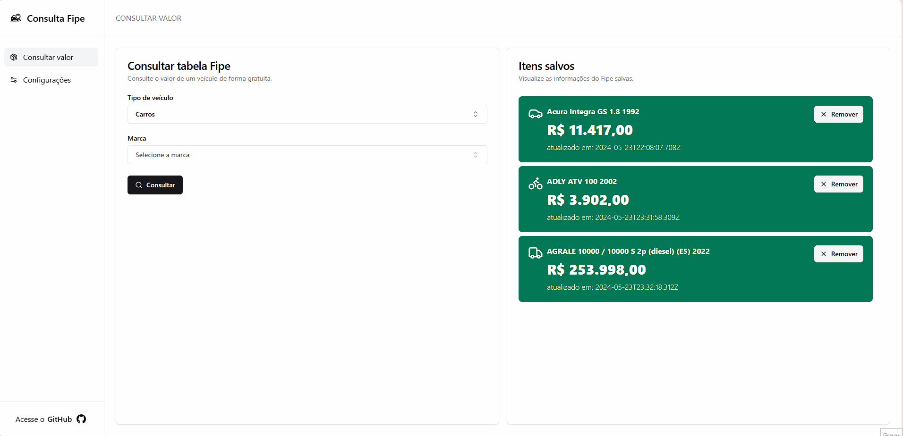

# 🚗 Consulta Fipe</h1>

  
  
  
  

## 📑 About

Consulta Fipe is an app designed to assist in researching the current value of a vehicle. The application consumes a public API that provides updated data from the table created by the Economic Research Institute Foundation and displays it on the screen in an appealing and intuitive manner for the user. 

It also allows the user to save the value for comparison purposes, taking into account the time the search was made.

## 🌟 Features

- Consumption of public API
- State management using Tanstack Query
- Theme switching options and responsive design
- State persistence in Local Storage with the help of Zustand

## 🎮 Running Locally

### 1. Clone this repository:
<pre>
  <code>
    git clone https://github.com/lorenzoa7/consulta-fipe.git
  </code>
</pre>

<h3>2. Install the dependencies:</h3>
<pre>
  <code>
    npm install
  </code>
</pre>

<h3>3. Start the server</h3>
<pre>
  <code>
    npm run dev
  </code>
</pre>

## 🔧 Credits
<a href="https://github.com/lorenzoa7" style='display: flex; flex-direction: column; align-items: center;'>
     
    
        <b>Lorenzo Aceti</b>
    
</a>